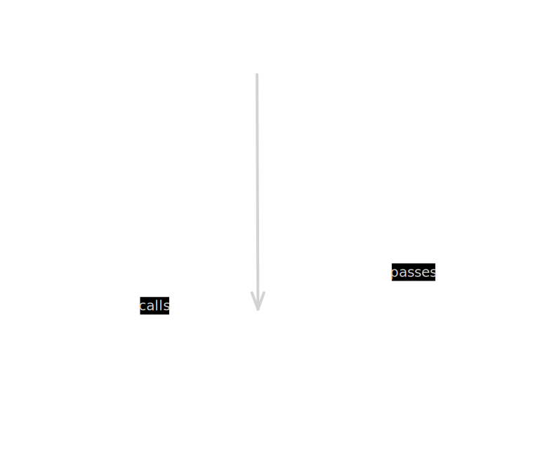
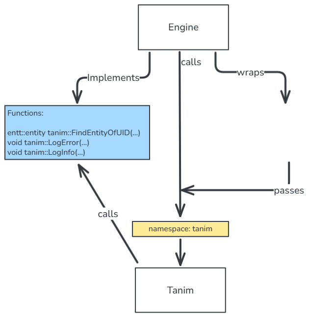
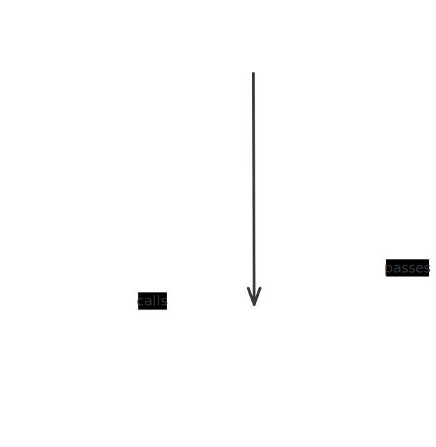
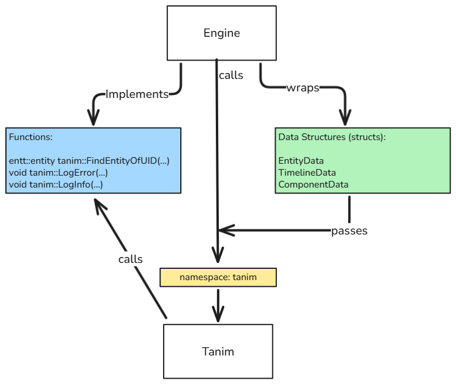

# Introduction

## About the article

I have made an open-source C++ timeline animation library for projects that are based on ImGui & ENTT. The library is fully engine-independent, and comes with a feature-rich piece-wise cubic Bezier curve editor. In this article we dive deep into the architecture of the library, and the math behind the curve.

## Prerequisites

You need to know about these items to fully understand the article, as they are used, but not explained in detail:

- C++ 17+ knowledge, as the code is in C++, and some modern features like `std::any` are mentioned in the article.
- Familiarity with ECS concepts, and experience with the ENTT library, as Tanim is made for ENTT-based projects.

## Showcase

  
   
  <em>Rich Cubic Bezier Curve Editing</em>

  
   
  <em>Reusable Animations, Flexible Playback</em>

  
   
  <em>Multi-Sequence Timeline Editing</em>

  
   
  <em>Complex Multi-Property Animations</em>

# Design & Architecture

## Philosophy & Aim

I developed the project with having portability in mind. As long as a project (usually a custom engine) is using ImGui for editor GUI and ENTT for ECS, integrating Tanim into it should be fairly easy.

---

In short, this is what Tanim needs from the user:

- a few API calls to be called at correct moments (e.g., `tanim::Init();`, `tanim::Draw();`)
- 2 data structures to be wrapped into a component that you can attach to your entities (i.e., `tanim::TimelineData` and `tanim::ComponentData`)
- some functions to be implemented (e.g., `tanim::LogError`)

.svg)

## Storing Animation Data

- Structures needed to hold the animation data:
  - Timeline -> Sequence -> Curve -> Keyframe -> Tangent

## Data separation & reasons

- TimelineData
- ComponentData

## Serialization

- The idea behind it
- The tools involved (visit_struct, magic_enum, nlohmann json)

## Reflection

- Supporting Common Types
- Reflecting User Structs

## Forcing Types

- MetaTypes
- RepresentationTypes

## Different approaches to reusing an animation

- Old uuid way

VS

- New name-based system

# Curves

## Initial approach

- why started with this
- separate smoothstep, linear, constant

## Hermite

- what it is
- why did I decided to switch
- why did I choose hermite

## Bezier

- what it is
- why did I decided to switch (again!)
- continuity

## Bezier vs Hermite

- data representation
- evaluation
- conversion

## Mathematics

### Newton–Raphson method

- where & why we need it

### Tangents, and different presets

- monotonic in time: x (time) doesn't go back / no more than 1 value for any time / no loops in the curve
- the 1/3 rule: derivative of P1 equal to 0 gives t = 1/3, and for P2 gives 2/3. meaning that they have their maximum
  influence in these ts. it makes sure of C2 continuity in piece-wise cubic curves. it is also industry standard.
- AUTO: Fritsch-Carlson monotonic Catmull-Rom
- Linear: control points point toward keyframes
- Flat: control points are horizontal

### Finding the extrema

### How constants are handled

### Challenges of quaternions

evaluation difference
forced type difference
delete/add keyframes difference
spins trick
representation types

# Performance

## stress test results

## the tool vs raw code

# Conclusion

## The future

- what would add-to/fix-in the tool with more time
- separating the curve editor from the animation part

## The tool

- where to get it
- the use documentation
- buas mention

## References

- all/or the most important references
